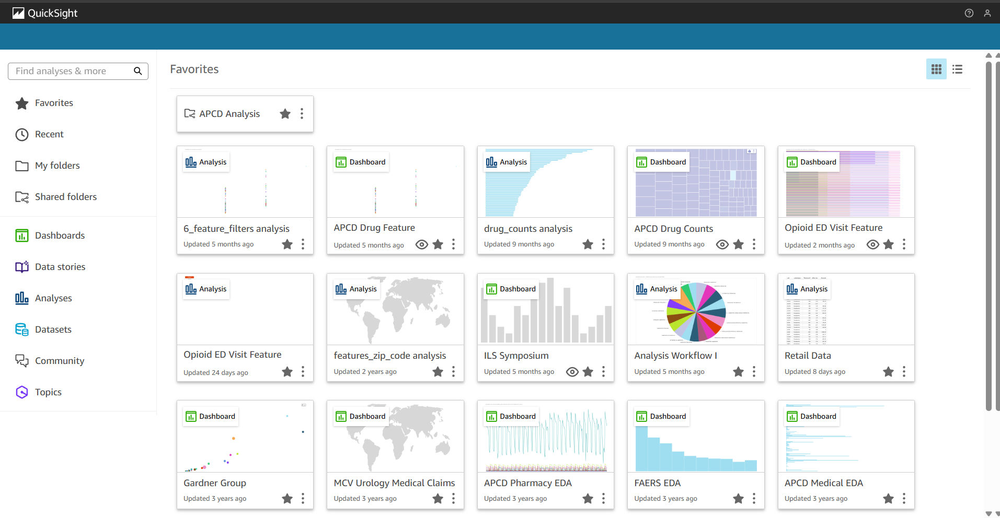
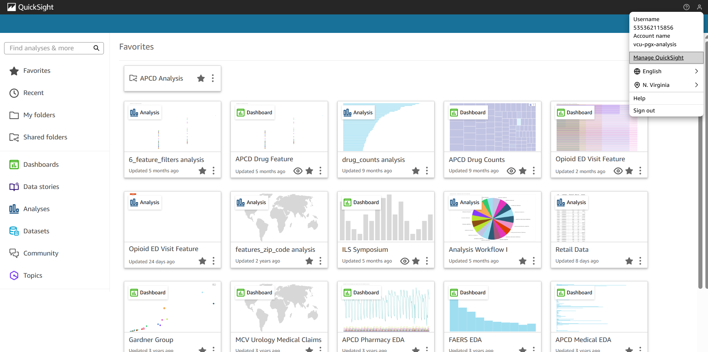
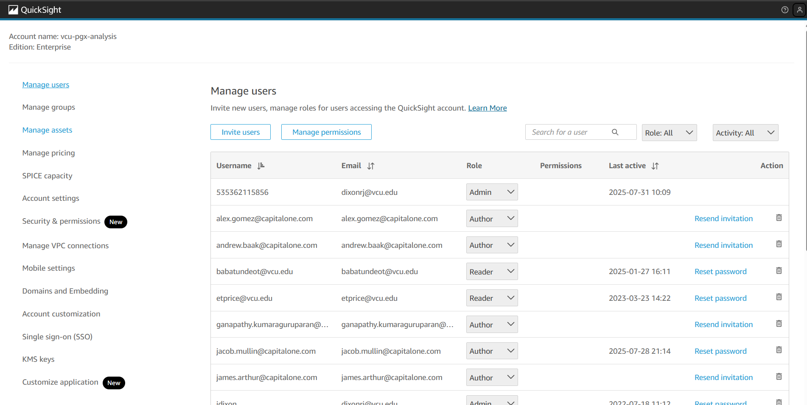
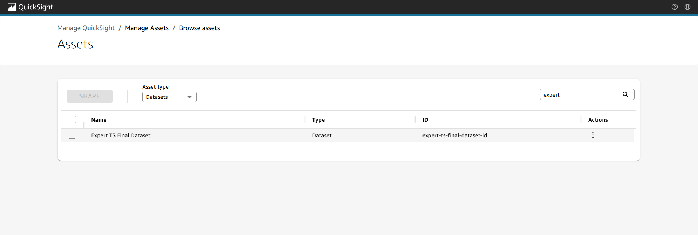
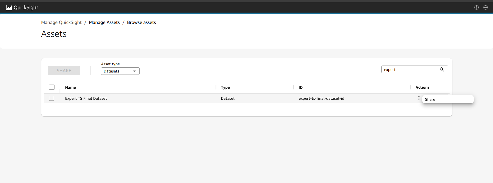
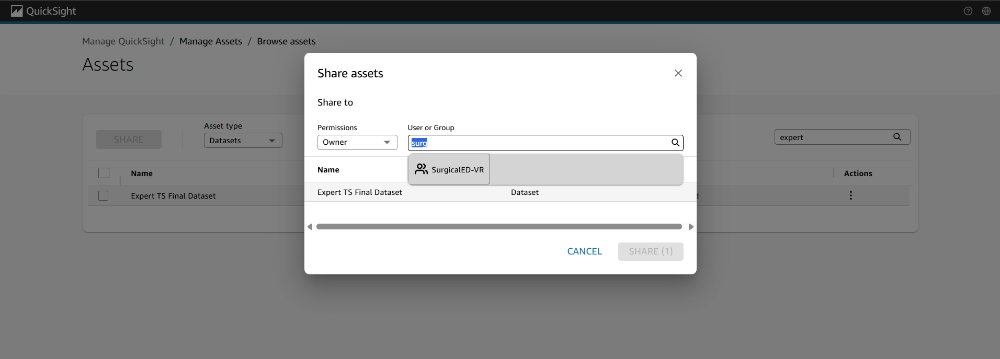
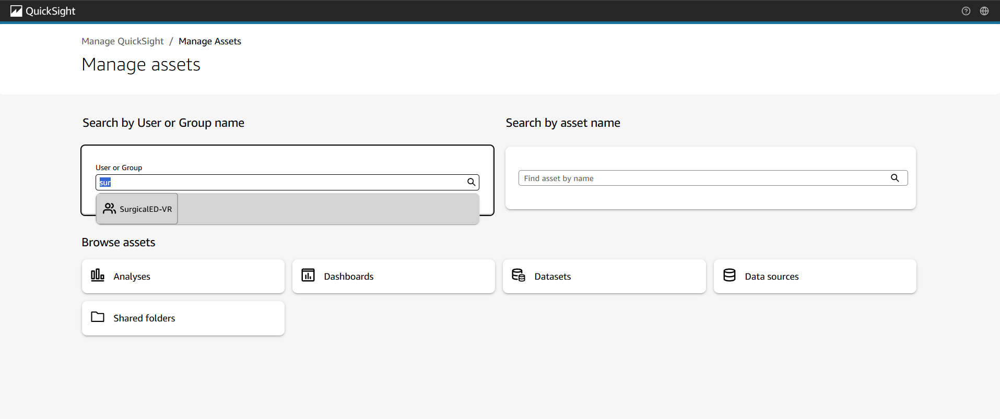
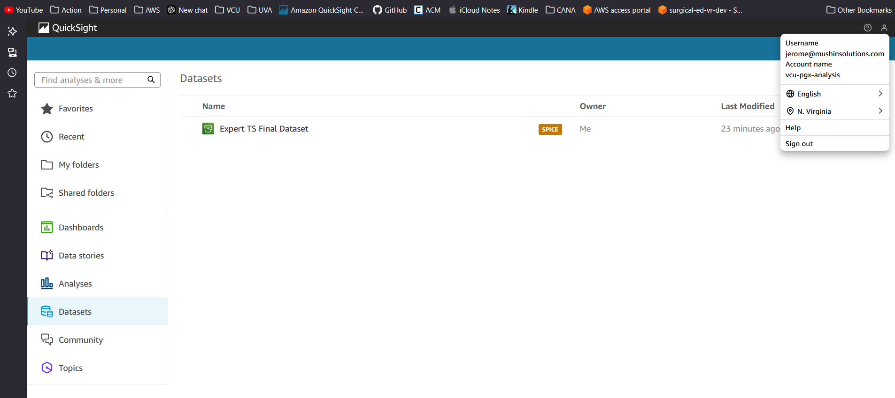
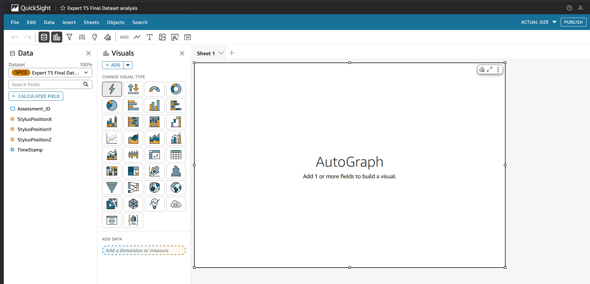

# AWS QuickSight Cross-Account Setup Guide

This document provides a complete, executable workflow for setting up cross-account AWS QuickSight access. The workflow includes:

1.  **Cross-account role assumption** from child to parent account
2.  **S3 data source creation** with manifest files
3.  **QuickSight dataset creation** with proper schema mapping
4.  **Dataset sharing** and permissions management

## Architecture Overview

-   **Child Account**: 711879567788 (vr_sling profile) - Contains S3 data
-   **Parent Account**: 535362115856 (mushin profile) - Hosts QuickSight
-   **Cross-Account Role**: arn:aws:iam::535362115856:role/QuickSightAuthorRole

## Prerequisites

-   AWS CLI configured with profiles: `vr_sling` (child) and `mushin` (parent)
-   QuickSight enabled in parent account
-   Cross-account IAM role already created with proper trust policy
-   S3 buckets accessible from child account


```{r message=FALSE, echo=FALSE}

library(here)
library(reticulate)
library(jsonlite)

```

### Helper Functions

```{python}

# Clean json characters

import json

def clean_surrogates(obj):
    if isinstance(obj, str):
        return obj.encode('utf-8', 'surrogatepass').decode('utf-8', 'ignore')
    elif isinstance(obj, dict):
        return {clean_surrogates(k): clean_surrogates(v) for k, v in obj.items()}
    elif isinstance(obj, list):
        return [clean_surrogates(i) for i in obj]
    else:
        return obj

```

## Cross-Account Authentication Setup

### Assume Cross-Account Role

- This step assumes the QuickSight role in the parent account from the child account, creating temporary credentials for QuickSight operations.

```{bash}

# === CONFIGURATION ===
CHILD_PROFILE="vr_sling"
PARENT_ACCOUNT_ID="535362115856"
CHILD_ACCOUNT_ID="711879567788"
ROLE_NAME="QuickSightAuthorRole"
REGION="us-east-1"
DURATION=43200  # max 12 hours (in seconds)
SESSION_NAME="qs-api-session"
TEMP_PROFILE="qs_temp"

echo "Starting cross-account role assumption..."
echo "Child Account: $CHILD_ACCOUNT_ID (Profile: $CHILD_PROFILE)"
echo "Parent Account: $PARENT_ACCOUNT_ID"
echo "Role: $ROLE_NAME"
echo "Session Duration: $((DURATION/3600)) hours"
echo "================================"

# === Assume Role ===
echo "Assuming role in parent account..."
CREDS=$(aws sts assume-role \
  --profile "$CHILD_PROFILE" \
  --region "$REGION" \
  --role-arn "arn:aws:iam::$PARENT_ACCOUNT_ID:role/$ROLE_NAME" \
  --role-session-name "$SESSION_NAME" \
  --duration-seconds $DURATION \
  --query 'Credentials' \
  --output json)

if [[ $? -eq 0 ]]; then
  echo "✅ Successfully assumed role"
else
  echo "Failed to assume role"
  exit 1
fi

# === Extract credentials ===
AWS_ACCESS_KEY_ID=$(echo $CREDS | jq -r '.AccessKeyId')
AWS_SECRET_ACCESS_KEY=$(echo $CREDS | jq -r '.SecretAccessKey')
AWS_SESSION_TOKEN=$(echo $CREDS | jq -r '.SessionToken')

# === Configure a temporary CLI profile ===
echo " Configuring temporary CLI profile..."
aws configure set aws_access_key_id "$AWS_ACCESS_KEY_ID" --profile "$TEMP_PROFILE"
aws configure set aws_secret_access_key "$AWS_SECRET_ACCESS_KEY" --profile "$TEMP_PROFILE"
aws configure set aws_session_token "$AWS_SESSION_TOKEN" --profile "$TEMP_PROFILE"
aws configure set region "$REGION" --profile "$TEMP_PROFILE"

echo "✅ Temporary profile '$TEMP_PROFILE' configured. Valid for $((DURATION/3600)) hours."

# === Export environment variables for Python/other tools ===
export AWS_ACCESS_KEY_ID="$AWS_ACCESS_KEY_ID"
export AWS_SECRET_ACCESS_KEY="$AWS_SECRET_ACCESS_KEY"
export AWS_SESSION_TOKEN="$AWS_SESSION_TOKEN"
export PARENT_ACCOUNT_ID="$PARENT_ACCOUNT_ID"
export AWS_PROFILE="$TEMP_PROFILE"
export AWS_REGION="$REGION"

echo "🌍 Environment variables exported for cross-account operations"

# === Test QuickSight API Access ===
echo "Testing QuickSight API access..."
QS_TEST=$(aws quicksight list-dashboards \
  --aws-account-id "$PARENT_ACCOUNT_ID" \
  --profile "$TEMP_PROFILE" 2>&1)

if echo "$QS_TEST" | grep -q "DashboardSummaryList\|RequestId"; then
  echo "✅ QuickSight API access confirmed"
  DASHBOARD_COUNT=$(echo "$QS_TEST" | jq '.DashboardSummaryList | length' 2>/dev/null || echo "0")
  echo "   Found $DASHBOARD_COUNT dashboards in parent account"
else
  echo "QuickSight API test result:"
  echo "$QS_TEST"
fi

echo "================================"
echo "🎉 Cross-account setup complete!"

```

## Data Source Discovery and Preparation

### Discover Available S3 Data

List and explore S3 buckets and objects in the child account to identify data sources for QuickSight.

```{bash}

echo "📊 Discovering S3 data sources in child account..."
echo "Account ID: $CHILD_ACCOUNT_ID"
echo "Profile: vr_sling"
echo "================================"

# List all S3 buckets in child account
echo "🪣 Available S3 buckets:"
aws s3 ls --profile vr_sling


```

### Explore Specific Bucket Contents

Examine the structure and contents of the target S3 bucket to understand the data objects available.

```{bash eval=FALSE}

# List objects in the target bucket recursively
echo "📁 Objects in surgical-ed-vr-dev bucket:"

echo ""
aws s3 ls surgical-ed-vr-dev --recursive --profile vr_sling

```

```{bash}

echo "This file will be used for QuickSight dataset creation:"
echo "Target dataset: experts/expert_ts_dataset_final.csv 📈"


```

### Validate Data File Access

Verify that the target CSV file is accessible and examine its structure.

```{bash}

# Test file access and get metadata
echo "🔍 Validating target data file access..."
aws s3api head-object \
  --bucket surgical-ed-vr-dev \
  --key experts/expert_ts_dataset_final.csv \
  --profile vr_sling

echo ""
echo "Getting file preview (first 10 lines):"
aws s3 cp s3://surgical-ed-vr-dev/experts/expert_ts_dataset_final.csv - \
  --profile vr_sling 2>/dev/null | head -10 || true

```

## QuickSight Data Source Creation

### S3 Manifest File Function

QuickSight requires a manifest file to define S3 data sources. This function creates and uploads the manifest to a designated bucket for manifest ('surgical-ed-vr-manifests')

```{python}

import boto3
import json
import os

def create_and_upload_manifest(source_bucket, object_key, file_name_without_ext, manifest_bucket, profile_name):
    """
    Creates a QuickSight S3 manifest file and uploads it to the specified bucket.
    
    Args:
        source_bucket (str): S3 bucket containing the source data
        object_key (str): Path to the source data file
        file_name_without_ext (str): Base filename without extension
        manifest_bucket (str): Bucket to store the manifest file
        profile_name (str): AWS CLI profile to use
    
    Returns:
        str: S3 URL of the uploaded manifest file
    """
    
    print(f"Creating manifest for: s3://{source_bucket}/{object_key}")
    
    # Create a session with the specified profile
    session = boto3.Session(profile_name=profile_name)
    s3_client = session.client("s3")

    # Create JSON document for this .csv file
    manifest_json = {
        "entries": [
            {
                "url": f"s3://{source_bucket}/{object_key}",
                "mandatory": True
            }
        ]
    }

    manifest_content = json.dumps(manifest_json, indent=2)
    manifest_file_name = f"manifest_{file_name_without_ext}.json"
    
    print(f"Manifest content:")
    print(manifest_content)
    print(f"Uploading manifest file: {manifest_file_name}")

    try:
        # Upload manifest to S3
        s3_client.put_object(
            Bucket=manifest_bucket,
            Key=manifest_file_name,
            Body=manifest_content,
            ContentType='application/json'
        )
        
        manifest_s3_url = f"s3://{manifest_bucket}/{manifest_file_name}"
        print(f"Manifest file uploaded successfully to: {manifest_s3_url}")
        return manifest_s3_url
        
    except Exception as e:
        print(f"Error uploading manifest file: {e}")
        raise

```

#### Create and Upload Manifest

- Create and upload the manifest file for the expert dataset.

```{python}

# Configuration for manifest creation
SOURCE_BUCKET = "surgical-ed-vr-dev"
OBJECT_KEY = "experts/expert_ts_dataset_final.csv"
FILE_NAME_WITHOUT_EXT = "expert_ts_dataset_final"
MANIFEST_BUCKET = "surgical-ed-vr-manifests"
CHILD_PROFILE = "vr_sling"

print("Starting manifest creation process...")
print(f"Source: s3://{SOURCE_BUCKET}/{OBJECT_KEY}")
print(f"Manifest destination: s3://{MANIFEST_BUCKET}/")
print("=" * 50)

# Create and upload manifest
try:
    manifest_url = create_and_upload_manifest(
        source_bucket=SOURCE_BUCKET,
        object_key=OBJECT_KEY,
        file_name_without_ext=FILE_NAME_WITHOUT_EXT,
        manifest_bucket=MANIFEST_BUCKET,
        profile_name=CHILD_PROFILE
    )
    print(f"Manifest creation completed!")
    print(f"Manifest URL: {manifest_url}")
    
except Exception as e:
    print(f"Manifest creation failed: {e}")

```

### QuickSight Data Source Function

Create a QuickSight data source that references the S3 manifest file.

```{python}

import boto3
import os

def create_qs_data_source(aws_account_id, datasource_id, datasource_name, manifest_bucket, manifest_object_key, profile_name="qs_temp"):
    """
    Creates a QuickSight S3 data source using a manifest file.
    
    Args:
        aws_account_id (str): AWS account ID where QuickSight is hosted
        datasource_id (str): Unique identifier for the data source
        datasource_name (str): Human-readable name for the data source
        manifest_bucket (str): S3 bucket containing the manifest file
        manifest_object_key (str): S3 key of the manifest file
        profile_name (str): AWS CLI profile to use (with assumed role credentials)
    
    Returns:
        dict: Response from QuickSight create_data_source API
    """
    
    print(f"Creating QuickSight data source...")
    print(f"Account ID: {aws_account_id}")
    print(f"Data Source ID: {datasource_id}")
    print(f"Data Source Name: {datasource_name}")
    print(f"Manifest: s3://{manifest_bucket}/{manifest_object_key}")
    
    # Create a session using the AWS CLI profile
    session = boto3.Session(profile_name=profile_name)
    quicksight_client = session.client("quicksight")

    try:
        response = quicksight_client.create_data_source(
            AwsAccountId=aws_account_id,
            DataSourceId=datasource_id,
            Name=datasource_name,
            Type='S3',
            DataSourceParameters={
                'S3Parameters': {
                    'ManifestFileLocation': {
                        'Bucket': manifest_bucket,
                        'Key': manifest_object_key
                    }
                }
            },
            SslProperties={
                'DisableSsl': False
            }
        )

        print("Data source created successfully!")
        print(f"Data Source ARN: {response['Arn']}")
        print(f"Data Source Status: {response['CreationStatus']}")

        return response

    except Exception as e:
        print(f"Error creating data source: {e}")
        raise

```

#### Create Data Source in AWS QuickSight Function

- Create the QuickSight data source with proper configuration.

```{python}

import os

# Get configuration from environment or set defaults
PARENT_ACCOUNT_ID = os.getenv("PARENT_ACCOUNT_ID", "535362115856")
MANIFEST_BUCKET = "surgical-ed-vr-manifests"
FILE_NAME_WITHOUT_EXT = "expert_ts_dataset_final"

# Generate data source identifiers
datasource_name = f"{FILE_NAME_WITHOUT_EXT}_data_source"
datasource_id = "expert-ts-dataset-final-data-source-id"
manifest_object_key = f"manifest_{FILE_NAME_WITHOUT_EXT}.json"

print("Starting QuickSight data source creation...")
print(f"DataSource Name: {datasource_name}")
print(f"DataSource ID: {datasource_id}")
print(f"Manifest Key: {manifest_object_key}")
print("=" * 50)

# Create the data source
try:
    datasource_response = create_qs_data_source(
        aws_account_id=PARENT_ACCOUNT_ID,
        datasource_id=datasource_id,
        datasource_name=datasource_name,
        manifest_bucket=MANIFEST_BUCKET,
        manifest_object_key=manifest_object_key,
        profile_name="qs_temp"
    )
    
    # Store the data source ARN for later use
    DATASOURCE_ARN = datasource_response['Arn']
    print(f"Data source creation completed!")
    print(f"ARN: {DATASOURCE_ARN}")
    
except Exception as e:
    print(f"Data source creation failed: {e}")

```

## Dataset Schema Definition and Creation

### Schema Analysis and Column Type Mapping

- Analyze the CSV file structure and create proper column type mappings for QuickSight.

```{python}

import boto3
import pandas as pd
import json
from urllib.parse import urlparse


def analyze_csv_schema(s3_url, profile_name):
    """
    Downloads and analyzes a CSV file from S3 to determine column types for QuickSight.
    
    Args:
        s3_url (str): S3 URL of the CSV file
        profile_name (str): AWS profile to use for S3 access
    
    Returns:
        list: List of column definitions with names and QuickSight-compatible types
    """
    
    print(f"Analyzing CSV schema from: {s3_url}")
    
    # Parse S3 URL
    parsed = urlparse(s3_url)
    bucket = parsed.netloc
    key = parsed.path.lstrip("/")
    
    print(f"Bucket: {bucket}")
    print(f"Key: {key}")
    
    # Create S3 client
    session = boto3.Session(profile_name=profile_name)
    s3_client = session.client("s3")
    
    try:
        # Download and read CSV
        print("Downloading CSV file...")
        obj = s3_client.get_object(Bucket=bucket, Key=key)
        df = pd.read_csv(obj["Body"])
        
        print(f"CSV loaded successfully!")
        print(f"Shape: {df.shape}")
        print(f"Columns: {list(df.columns)}")
        
        # Define QuickSight type mapping
        dtype_map = {
            "object": "STRING",
            "int64": "INTEGER", 
            "int32": "INTEGER",
            "float64": "DECIMAL",
            "float32": "DECIMAL", 
            "bool": "BOOLEAN",
            "datetime64[ns]": "DATETIME"
        }
        
        # Generate column definitions
        input_columns = []
        print("\n Column Analysis:")
        print("-" * 50)
        
        for col in df.columns:
            pandas_type = str(df[col].dtype)
            qs_type = dtype_map.get(pandas_type, "STRING")
            sample_values = df[col].head(3).tolist()
            
            input_columns.append({"Name": col, "Type": qs_type})
            
            print(f"Column: {col}")
            print(f"  Pandas Type: {pandas_type}")
            print(f"  QuickSight Type: {qs_type}")
            print(f"  Sample Values: {sample_values}")
            print()
        
        return input_columns, df
        
    except Exception as e:
        print(f"Error analyzing CSV: {e}")
        raise

# Execute schema analysis
S3_CSV_URL = "s3://surgical-ed-vr-dev/experts/expert_ts_dataset_final.csv"
CHILD_PROFILE = "vr_sling"

print(" Starting CSV schema analysis...")
print("=" * 50)

try:
    input_columns, dataframe = analyze_csv_schema(S3_CSV_URL, CHILD_PROFILE)
    print(f"Schema analysis completed!")
    print(f"Found {len(input_columns)} columns")
    
except Exception as e:
    print(f"Schema analysis failed: {e}")

```

### Generate Physical Table Mapping

- Create the physical table definition that describes the S3 data source structure.

```{python}

def generate_physical_table_dict(table_physical_id, datasource_arn, input_columns):
    """
    Generates a physical table mapping for QuickSight dataset creation.
    
    Args:
        table_physical_id (str): Unique identifier for the physical table
        datasource_arn (str): ARN of the QuickSight data source
        input_columns (list): List of column definitions
    
    Returns:
        dict: Physical table mapping configuration
    """
    
    print(f"Generating physical table mapping...")
    print(f"Physical Table ID: {table_physical_id}")
    print(f"Data Source ARN: {datasource_arn}")
    print(f"Input Columns: {len(input_columns)}")
    
    physical_table = {
        table_physical_id: {
            "S3Source": {
                "DataSourceArn": datasource_arn,
                "UploadSettings": {
                    "Format": "CSV",
                    "StartFromRow": 1,
                    "ContainsHeader": True,
                    "TextQualifier": "DOUBLE_QUOTE",
                    "Delimiter": ","
                },
                "InputColumns": [
                    {"Name": column["Name"], "Type": "STRING"} for column in input_columns
                ]
            }
        }
    }
    
    print("Physical table mapping generated")
    return physical_table

```

### Generate Logical Table Mapping

- Create the logical table definition with data transformations and type casting.

```{python}

def generate_logical_table_dict(base_filename, table_logical_id, table_physical_id, input_columns):
    """
    Generates a logical table mapping with data transformations for QuickSight.
    
    Args:
        base_filename (str): Base name for the table alias
        table_logical_id (str): Unique identifier for the logical table
        table_physical_id (str): Identifier of the associated physical table
        input_columns (list): List of column definitions with types
    
    Returns:
        dict: Logical table mapping configuration with transformations
    """
    
    print(f"Generating logical table mapping...")
    print(f"Logical Table ID: {table_logical_id}")
    print(f"Physical Table ID: {table_physical_id}")
    print(f"Base Filename: {base_filename}")
    
    logical_table = {
        table_logical_id: {
            "Alias": base_filename,
            "DataTransforms": [],
            "Source": {
                "PhysicalTableId": table_physical_id
            }
        }
    }

    # Add column type casting transformations
    for column in input_columns:
        column_name = column["Name"]
        new_column_type = column["Type"]

        # Add type casting transformation
        logical_table[table_logical_id]["DataTransforms"].append({
            "CastColumnTypeOperation": {
                "ColumnName": column_name,
                "NewColumnType": new_column_type
            }
        })

        # Add geographic role tags for region columns
        if column_name in ("Region", "Region_MEF_Lead"):
            logical_table[table_logical_id]["DataTransforms"].append({
                "TagColumnOperation": {
                    "ColumnName": column_name,
                    "Tags": [{"ColumnGeographicRole": "STATE"}]
                }
            })

    # Add projection operation to select all columns
    logical_table[table_logical_id]["DataTransforms"].append({
        "ProjectOperation": {
            "ProjectedColumns": [col["Name"] for col in input_columns]
        }
    })

    print(f"Logical table mapping generated with {len(logical_table[table_logical_id]['DataTransforms'])} transformations")
    return logical_table

```

#### Generate JSON Dictionary Table Mappings

Execute the table mapping generation with the analyzed schema.

```{python}

# Configuration for table mappings
FILE_NAME = "expert_ts_dataset_final"
TABLE_LOGICAL_ID = "expert-ts-dataset-final-logical"
TABLE_PHYSICAL_ID = "expert-ts-dataset-final-physical"
PARENT_ACCOUNT_ID = "535362115856"
DATASOURCE_ARN = "arn:aws:quicksight:us-east-1:535362115856:datasource/expert-ts-dataset-final-data-source-id"


# Use the data source ARN from previous step
if 'DATASOURCE_ARN' not in locals():
    DATASOURCE_ARN = f"arn:aws:quicksight:us-east-1:{PARENT_ACCOUNT_ID}:datasource/{datasource_id}"

print("Generating table mappings...")
print(f"File Name: {FILE_NAME}")
print(f"Logical Table ID: {TABLE_LOGICAL_ID}")
print(f"Physical Table ID: {TABLE_PHYSICAL_ID}")
print("=" * 50)

try:
    # Generate physical table mapping
    physical_table_dict = generate_physical_table_dict(
        table_physical_id=TABLE_PHYSICAL_ID,
        datasource_arn=DATASOURCE_ARN,
        input_columns=input_columns
    )
    
    # Generate logical table mapping  
    logical_table_dict = generate_logical_table_dict(
        base_filename=FILE_NAME,
        table_logical_id=TABLE_LOGICAL_ID,
        table_physical_id=TABLE_PHYSICAL_ID,
        input_columns=input_columns
    )
    
    print("Table mappings generated successfully!")
    print("\nPhysical Table Structure:")
    print(json.dumps(physical_table_dict, indent=2))
    
    print("\nLogical Table Structure:")
    print(json.dumps(logical_table_dict, indent=2))
    
except Exception as e:
    print(f" Table mapping generation failed: {e}")

```

## QuickSight Dataset Creation and Management

### Create QuickSight Dataset Function

Create a QuickSight dataset using the physical and logical table mappings with proper error handling and validation.

```{python}

import boto3
import json

def create_qs_dataset(
    aws_account_id,
    dataset_id,
    dataset_name,
    physical_table_map,
    logical_table_map,
    principal_user_arn,
    profile_name="qs_temp",
    region="us-east-1"
):
    """
    Creates a QuickSight dataset with specified table mappings and permissions.
    
    Args:
        aws_account_id (str): AWS account ID hosting QuickSight
        dataset_id (str): Unique identifier for the dataset
        dataset_name (str): Human-readable name for the dataset
        physical_table_map (dict): Physical table mapping configuration
        logical_table_map (dict): Logical table mapping configuration
        principal_user_arn (str): ARN of the principal user to grant permissions
        profile_name (str): AWS CLI profile to use
        region (str): AWS region
    
    Returns:
        dict: Response from QuickSight create_data_set API
    """
    
    print(f"Creating QuickSight dataset...")
    print(f"Account ID: {aws_account_id}")
    print(f"Dataset ID: {dataset_id}")
    print(f"Dataset Name: {dataset_name}")
    print(f"Principal User: {principal_user_arn}")
    print(f"Region: {region}")
    
    # Validate inputs
    if not physical_table_map:
        raise ValueError("Physical table map cannot be empty")
    if not logical_table_map:
        raise ValueError("Logical table map cannot be empty")
    
    # Create a session using the temporary profile
    session = boto3.Session(profile_name=profile_name, region_name=region)
    quicksight = session.client("quicksight")

    try:
        print("Sending dataset creation request...")
        
        response = quicksight.create_data_set(
            AwsAccountId=aws_account_id,
            DataSetId=dataset_id,
            Name=dataset_name,
            PhysicalTableMap=physical_table_map,
            LogicalTableMap=logical_table_map,
            ImportMode="SPICE",
            Permissions=[
                {
                    "Principal": principal_user_arn,
                    "Actions": [
                        "quicksight:DescribeDataSet",
                        "quicksight:DescribeDataSetPermissions",
                        "quicksight:PassDataSet",
                        "quicksight:DescribeIngestion",
                        "quicksight:ListIngestions",
                        "quicksight:UpdateDataSet",
                        "quicksight:DeleteDataSet",
                        "quicksight:CreateIngestion",
                        "quicksight:CancelIngestion",
                        "quicksight:UpdateDataSetPermissions"
                    ]
                }
            ]
        )
        
        print("Dataset created successfully!")
        print(f"Dataset ARN: {response['Arn']}")
        print(f"Dataset Status: {response['CreationStatus']}")
        
        return response

    except Exception as e:
        print(f"Error creating dataset: {e}")
        
        # Provide helpful error context
        if "InvalidParameterValueException" in str(e):
            print("Check that table mappings are valid JSON and data source exists")
        elif "ResourceExistsException" in str(e):
            print("Dataset with this ID already exists - use a different ID or update existing")
        elif "AccessDeniedException" in str(e):
            print("Check that the assumed role has QuickSight permissions")
            
        raise

```

#### Execute Dataset Creation

- Create the dataset with proper configuration and error handling.

PRINCIPAL_USER_ARN = "arn:aws:quicksight:us-east-1:535362115856:user/default/jdixon@mushinsolutions.com"

**Replace 'jdixon@mushinsolutions.com' with your capitalone email address**

```{python}

import os

# Configuration for dataset creation
DATASET_ID = "expert-ts-final-dataset-id"
DATASET_NAME = "Expert TS Final Dataset"
PRINCIPAL_USER_ARN = "arn:aws:quicksight:us-east-1:535362115856:user/default/jdixon@mushinsolutions.com"

# Get account ID from environment
PARENT_ACCOUNT_ID = os.getenv("PARENT_ACCOUNT_ID", "535362115856")

print("Starting QuickSight dataset creation...")
print(f"Dataset ID: {DATASET_ID}")
print(f"Dataset Name: {DATASET_NAME}")
print(f"Principal User: {PRINCIPAL_USER_ARN}")
print("=" * 50)

# Validate that we have the required table mappings
if 'physical_table_dict' not in locals() or 'logical_table_dict' not in locals():
    print("Table mappings not found. Please run the table mapping generation steps first.")
    print("Required variables: physical_table_dict, logical_table_dict")
else:
    try:
        # Create the dataset
        dataset_response = create_qs_dataset(
            aws_account_id=PARENT_ACCOUNT_ID,
            dataset_id=DATASET_ID,
            dataset_name=DATASET_NAME,
            physical_table_map=physical_table_dict,
            logical_table_map=logical_table_dict,
            principal_user_arn=PRINCIPAL_USER_ARN,
            profile_name="qs_temp"
        )
        
        # Store dataset ARN for later use
        DATASET_ARN = dataset_response['Arn']
        print(f"Dataset creation completed!")
        print(f"Dataset ARN: {DATASET_ARN}")
        
        # Trigger initial data ingestion
        print("\nTriggering initial data ingestion...")
        
        ingestion_response = boto3.Session(profile_name="qs_temp").client("quicksight").create_ingestion(
            DataSetId=DATASET_ID,
            IngestionId=f"{DATASET_ID}-initial-ingestion",
            AwsAccountId=PARENT_ACCOUNT_ID
        )
        
        print(f"Data ingestion started successfully!")
        print(f"Ingestion ARN: {ingestion_response.get('IngestionArn')}")
        print(f"Ingestion ID: {ingestion_response.get('IngestionId')}")

        
    except Exception as e:
        print(f"Dataset creation failed: {e}")
        print("\nTroubleshooting tips:")
        print("- Verify that the data source exists and is accessible")
        print("- Check that table mappings are valid")
        print("- Ensure the principal user ARN is correct")
        print("- Verify QuickSight permissions for the assumed role")

```

## Dataset Sharing and Permission Management {.scrollable}

#### Go to Quick Sight Dashboard



<br>
<br>

####  Manage Assets



<br>
<br>



<br>
<br>

####  Share Asset to Group



<br>



<br>




<br>
<br>

#### Group Assets



<br>
<br>

#### Group Assets from QuickSight Dashboard



<br>
<br>

#### Create Analysis!

